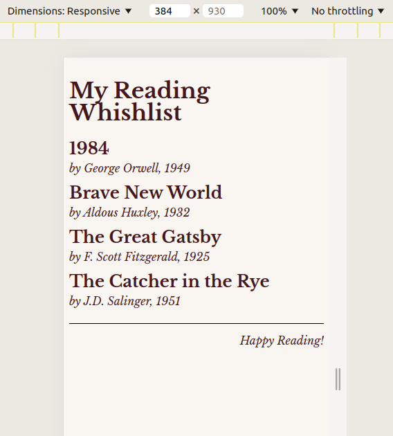
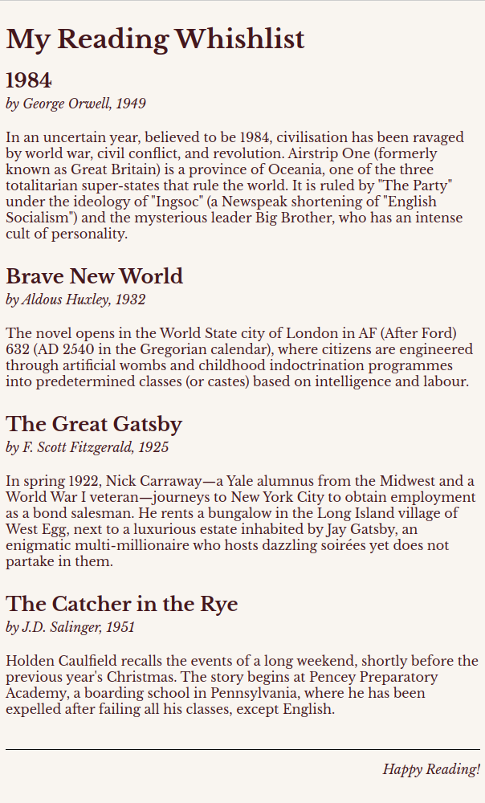
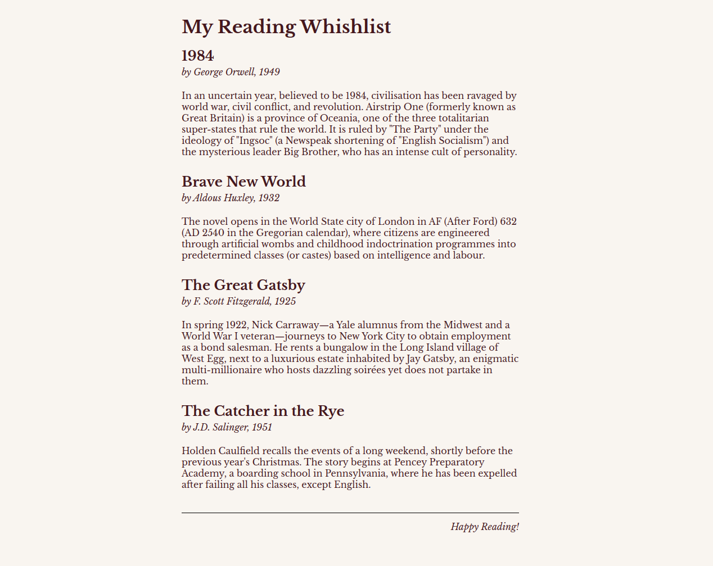

# Sitebuild and Deploy 🌍

## Tasks

1. Implement your solution in the `./src` folder.
2. Use the specification details and the wireframes as a reference.
3. When you are ready, copy or build your src files to your `./dist` folder and publish it using Firebase Hosting or Github Pages (or you can use any hosting solution you know). Copy-paste the deployed URL to the `published_url.txt`.

## Specification

You need to create reading whishlist. The information about the books can be found in the [./books.txt](./books.txt) in this folder.

### Markup

- The page has three parts, the header, the main content and a footer.
- The header contains a level 1 header, the title of the page, "My Reading Whishlist".
- The main section consists of four articles each article represents a book's summary to read. 
- Each article summary has three parts. 
  1. level 2 header, the title of the book. 
  2. It is followed by some information about the book (the Author and the release year). 
  3. A paragraph long of summary of the book.
- The page is closed by a footer, with an encouraging message "Happy Reading!"
- It can be helpful, but not obligatory to use  a container div to encapsulate these three parts.

### Style

- Use the font [Libre Baskerville](https://fonts.google.com/specimen/Libre+Baskerville) on the page. The font size of the root element (`html`) should be 16px.ok
- The background color of the page should be `#f9f5f0` and the text's color should be `#45171d`.ok
- The page should be 600px wide at most, and it should be aligned center on the page. There should be a `2rem` space between the top of the viewport and the page's content, also a `1rem` left and right space even on small screen sizes.ok
- There should be `1rem` gap between three parts (header, main, footer).
- The title of the page should be `2rem` large and it should be bold.
- The list of the book summaries should be separated with a `1rem` gap.
- In a book summary article:
  - There should be a `0.5rem` gap between the title, the info section and the plot. 
  - The title of the book should be `1.5rem` large and it should be bold.
  - The font's style in the info box should italic. 
  - The plot must have also an additional `1rem` margin on the top and on the bottom to the `0.5rem` gap. The line height in the plot must be `1.25rem`.
- The footer should be separated with a `1px` solid `black` line from the main content. There should be a `1rem` large space between the footer message and the line.
- The footer message should be styled as italic and is should be justified right.
- If the screen width is smaller than 400px, do not display the plot of the books.

### Wireframes

The site should look the **same** as these screenshots.

#### Mobile (width < 400px)

- The plots are not displayed.

#### Tablet (width between 400px and 600px)

- There is a small padding on the left and right side.

#### Desktop (width > 600px)

- At most 600px wide content, centered.

## Hints

- You can use the VS Code Live Server extension (or any static server) to test your implementation.
- You can use the `reset.css` to create a baseline of your CSS implementation.
- You can implement the task in native CSS or using Tailwind.
- If you use Tailwind you need to build your source code, if you use native CSS, you can skip that step.
- Do not take care of the `.gitkeep` files. They are needed to keep their parent directories in git.
- 
